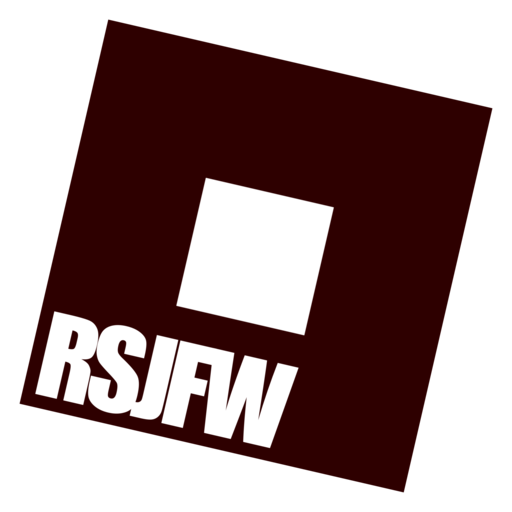

# RSJFW Reborn
**Roblox Studio Just Fucking Works**. REBORN!



  

The high-performance, native C++20 Linux environment for Roblox Studio. Built to obliterate Python/Shell/Go wrappers with raw speed and engineering precision.

RSJFW is a clean-room engineered solution designed for maximum performance and stability. It's an engine, not a simple command runner.

## Why RSJFW?
Legacy wrappers are slow, bloated, and prone to breakage. RSJFW is built for the absolute best experience.

| Feature | Legacy Wrappers | RSJFW |
|---------|-----------------|-------|
| **Core Architecture** | Python / Bash Glue | **Native C++20 Engine** |
| **WebView2** | Barely working | **Native Support** (tested best with Proton)
| **Startup Latency** | 2-5 Seconds | **< 200ms** |
| **Protocol Handling** | Fragile, often breaks | **Native Socket/Pipe Interop** |
| **Diagnostics** | "Check the logs" | **Self-Healing Orchestrator** |
| **Asset Control** | External downloads | **Precise Binary Selection** |
| **GPU Management** | Manual env vars | **Auto-Discovery & Injection** |

## Features

*   **Zero-Latency UI**: Built with Dear ImGui and GLFW for an instant, responsive dashboard.
*   **Credential Management**: Real-time account tracking and automated session syncing between runners.
*   **UMU Runner**: First-class support for the Unified Linux Wine Runner (umu-run).
*   **Vulkan Layer**: Custom Vulkan layer for enhanced stability, enforcing triple buffering and fixing swapchain recreation issues.
*   **Modular Runners**: Support for **Steam Proton**, **GE-Proton**, and **System Wine**.
*   **Auto-Discovery**: Automatically finds your Steam Proton installations and GPU hardware.
*   **Live Diagnostics**: A real-time health grid that detects and fixes issues with dependencies, desktop entries, and protocol handlers.

## Usage

### 1. Registration (First Run)
After compiling, register RSJFW with your desktop environment to handle `roblox-studio://` links.
```bash
./rsjfw register
```

### 2. Configuration
Open the high-fidelity dashboard to configure runners, DXVK, and FFlags.
```bash
./rsjfw config
```

### 3. Launching
RSJFW automatically handles browser protocols. You can also launch it manually:
```bash
./rsjfw launch
```

## Recommended Workflow

For the best experience, we recommend the following workflow:

1.  **Login with Proton**: Use the **Proton** runner to log in to your Roblox account initially. The embedded WebView2 browser works most reliably under Proton for authentication flows.
2.  **Switch Runner**: Once logged in, switch to **UMU** or **Wine** for day-to-day development. Your credentials will be automatically synced.

## Build from Source

### Dependencies
*   CMake 3.14+
*   C++20 Compiler (GCC 10+ / Clang 10+)
*   Development headers: `libcurl`, `libarchive`, `glfw3`, `gtk3` (for file dialogs), `opengl`

### Compilation
```bash
mkdir build && cd build
cmake ..
make -j$(nproc)
```

## License

MIT License. See [LICENSE](LICENSE) for details.
